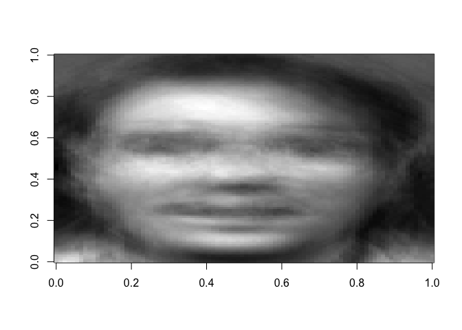

Facial Recognition: Principal Component Analysis
-------------------------------------------------

1.  [Problem Description](#problem-description)
2.  [Mean center the image matrix](#mean-center-the-image-matrix)
3.  [Perform SVD of the mean centered image
    matrix](#perform-svd-of-the-mean-centered-image-matrix)
    -   [Use scree plot to find k.](#use-scree-plot-to-find-k.)
    -   [See how distorted images are by using diffrent k
        values.](#see-how-distorted-images-are-by-using-diffrent-k-values.)
4.  [Classifying Test Images](#classifying-test-images)
5.  [Measure the distance between Vnew and V for each of the training
    images](#measure-the-distance-between-vnew-and-v-for-each-of-the-training-images)
    -   [Using k=20.](#using-k20.)
    -   [Using k=15.](#using-k15.)
    -   [Using k=13.](#using-k13.)

Problem Description
-------------------

Use principal components (via SVD) to first summarize the structure
found in a set of facial images and then use the structure to perform a
simple facial recognition procedure.

The data consist of 10 facial images for 40 individuals. We will use two
of the images for each individual as test cases to perform facial
recognition for. We will do a few random examples with some of the 80
test cases.

Each image is 112×92 pixels (112 rows and 92 columns of pixels). All
images are grayscale. Thus, each of the 40×8 = 320 images consists of
112×92=10304 pixels. The training images are stored in 10304×320 in the
data frame <b>OlivettiTrain</b> and the 80 test images are contained in
the data frame <b>OlivettiTest</b>; they are both contained in
Olivetti.rdata. There are two functions provided: a distance function
for weight vectors and a function to reset plot parameters. They can be
loaded from weightdist.rds and Reset\_Plotting\_Parameters.rds files.

The data is provided by Dr. Brant Deppa.

Generating the plot of images:

``` r
#This function will plot any chosen image
face.plot = function(temp,i=1){
  temp = matrix(temp[,i],112,92)
  temp = apply(temp,2,rev)
  image(t(temp),col=gray((0:111)/111))
}

#Plotting 8 images for the first 10 subjects
par(mfrow=c(10,8), mar=c(0,0,0,0), xaxt = "n", yaxt = "n")
for (i in 1:80){
  face.plot(OlivettiTrain, i)
}
```


Mean center the image matrix
----------------------------

``` r
OTmean = apply(OlivettiTrain, 1, mean)
```

###### Face plot of the average

``` r
face.plot(as.matrix(OTmean))
```


``` r
#Replicate 320 times, 10304x320 matrix
mean.mat = matrix(rep(OTmean, 320), 10304, 320)
#Check matrix dimension
dim(mean.mat)
```

    ## [1] 10304   320

###### Form mean centered image matrix

``` r
OT.mc = OlivettiTrain - mean.mat #substract to center
```

Perform SVD of the mean centered image matrix
---------------------------------------------

``` r
faces.svd = svd(OT.mc)
U = faces.svd$u
V = faces.svd$v
D = diag(faces.svd$d)
```

Check dimensions U, V, D. U dimensions.

``` r
dim(U)
```

    ## [1] 10304   320

U dimensions.

    ## [1] 320 320

D dimensions.

    ## [1] 320 320

U contains the eigenfaces (PC scores) and V contains the loadings.

Reproduce the original faces exactly by checking if X = UDV’.

``` r
TEST = U%*%D%*%t(V) + mean.mat
par(mfrow=c(10,8), mar=c(0,0,0,0), xaxt = "n", yaxt = "n")
for (i in 1:80){face.plot(TEST, i)}
```


It checks out.

### Use scree plot to find k.

``` r
plot(1:320, faces.svd$d, type = "b", main = "Scree Plot for Olivetti Faces")
```


### See how distorted images are by using diffrent k values.

Try k=30.

``` r
#k=30
Approx30 = U[,1:30]%*%D[1:30,1:30]%*%t(V[,1:30]) + mean.mat
par(mfrow=c(10,8), mar=c(0,0,0,0), xaxt = "n", yaxt = "n")
for (i in 1:80){
  face.plot(Approx30, i)
}
```


Try k=25.

``` r
#k=25
Approx25 = U[,1:25]%*%D[1:25,1:25]%*%t(V[,1:25]) + mean.mat
par(mfrow=c(10,8), mar=c(0,0,0,0), xaxt = "n", yaxt = "n")
for (i in 1:80){
  face.plot(Approx25, i)
}
```


Try k=20.

``` r
#k=20
Approx20 = U[,1:20]%*%D[1:20,1:20]%*%t(V[,1:20]) + mean.mat
par(mfrow=c(10,8), mar=c(0,0,0,0), xaxt = "n", yaxt = "n")
for (i in 1:80){
  face.plot(Approx20, i)
}
```


Try k=10.

``` r
#k=10
Approx10 = U[,1:10]%*%D[1:10,1:10]%*%t(V[,1:10]) + mean.mat
par(mfrow=c(10,8), mar=c(0,0,0,0), xaxt = "n", yaxt = "n")
for (i in 1:80){
  face.plot(Approx10, i)
}
```


<br></br>

Classifying Test Images
-----------------------

Form a 10304x80 matrix with columns equal to the mean pixel vector for
the \# training images (OTmean).

``` r
#Replicate 80 times, 10304x80 matrix
mean.test.mat = matrix(rep(OTmean,80),10304,80)
mean.mat = matrix(rep(OTmean, 320), 10304, 320)
#Check dimensions
dim(mean.test.mat)
```

    ## [1] 10304    80

Form mean centered image matrix

``` r
OTest.mc = OlivettiTest - mean.test.mat #substract to center
```

Compute the weight vectors for all 80 test images.

``` r
#U'*Mean Centered Matrix for Test
Vnew = t(U)%*%OTest.mc
#Check dimensions
dim(Vnew)
```

    ## [1] 320  80

Each column of V\_new is the full 320-dimensional projection of the new
facial image onto the eigenfaces, giving us the weights for constructing
an approximation to the test image using the eigenfaces from the
training images. If we want to use k=20, we can change the code below as
follows.

Measure the distance between Vnew and V for each of the training images
-----------------------------------------------------------------------

### Using k=20.

Images \#15,16,13 and 14.

``` r
Vnew20 = t(U[,1:20])%*%OTest.mc
```

Let’s see how, for, example, image \#15 projects into our training
eigenface space.

``` r
face20.approx = U[,1:20]%*%matrix(Vnew20[,15],20,1) + OTmean
face.plot(face20.approx)
```


``` r
#Distance function for weight vectors, k=20
weightdist = function(vnew,V,k=20) {
  d = rep(0,320)
  for (i in 1:320) {
    d[i]=sqrt(sum((vnew-t(V)[1:k,i])^2))
  }
  which.min(d)
}
```

<b>Classifying Test Image \#15</b>

``` r
face.plot(OlivettiTest, 15)
```


``` r
#Grab v_new vector for test image 15.
Vnew = Vnew20[,15] 
```

``` r
# Find nearest training image
weightdist(Vnew20[,15],V)
```

    ## [1] 120

``` r
#Check whether it's correct.
face.plot(OlivettiTrain, 120)
```


<br></br>In the train data, test image \#15 is in train pictures 113-120
(including).

<b>Classifying Test Image \#16</b>

``` r
face.plot(OlivettiTest, 16)
```


``` r
#Grab v_new vector for test image 16.
Vnew = Vnew20[,16] 
```

``` r
# Find nearest training image
weightdist(Vnew20[,16],V)
```

    ## [1] 126

``` r
#Check whether it's correct.
face.plot(OlivettiTrain, 126)
```


<b>Classifying Test Image \#13</b>

``` r
face.plot(OlivettiTest, 13)
```


``` r
#Grab v_new vector for test image 13.
Vnew = Vnew20[,13] 
```

``` r
# Find nearest training image
weightdist(Vnew20[,13],V)
```

    ## [1] 102

``` r
#Check whether it's correct.
face.plot(OlivettiTrain, 102)
```


<b>Classifying Test Image \#14</b>

``` r
face.plot(OlivettiTest, 14)
```


``` r
#Grab v_new vector for test image 14.
Vnew = Vnew20[,14] 
```

``` r
# Find nearest training image
weightdist(Vnew20[,14],V)
```

    ## [1] 106

``` r
#Check whether it's correct.
face.plot(OlivettiTrain, 106)
```


### Using k=15.

Images \#15,16,13,14,77,80 and 1.

``` r
Vnew15 = t(U[,1:15])%*%OTest.mc
```

Let’s see how, for example, image \#15 projects into our training
eigenface space.

``` r
face15.approx = U[,1:15]%*%matrix(Vnew15[,15],15,1) + OTmean
face.plot(face15.approx)
```


``` r
#Distance function for weight vectors
weightdist = function(vnew,V,k=15) {
  d = rep(0,320)
  for (i in 1:320) {
    d[i]=sqrt(sum((vnew-t(V)[1:k,i])^2))
  }
  which.min(d)
}
```

<b>Classifying Test Image \#15</b>

``` r
face.plot(OlivettiTest, 15)
```


``` r
#Grab v_new vector for test image 15.
Vnew = Vnew15[,15] 
```

``` r
# Find nearest training image
weightdist(Vnew15[,15],V)
```

    ## [1] 120

``` r
#Check whether it's correct.
face.plot(OlivettiTrain, 120)
```


<b>Classifying Test Image \#16</b>

``` r
face.plot(OlivettiTest, 16)
```


``` r
#Grab v_new vector for test image 16.
Vnew = Vnew15[,16] 
```

``` r
# Find nearest training image
weightdist(Vnew15[,16],V)
```

    ## [1] 126

``` r
#Check whether it's correct.
face.plot(OlivettiTrain, 126)
```


<b>Classifying Test Image \#13</b>

``` r
face.plot(OlivettiTest, 13)
```


``` r
#Grab v_new vector for test image 13.
Vnew = Vnew15[,13] 
```

``` r
# Find nearest training image
weightdist(Vnew15[,13],V)
```

    ## [1] 97

``` r
#Check whether it's correct.
face.plot(OlivettiTrain, 97)
```


<b>Classifying Test Image \#14</b>

``` r
face.plot(OlivettiTest, 14)
```


``` r
#Grab v_new vector for test image 14.
Vnew = Vnew15[,14] 
```

``` r
# Find nearest training image
weightdist(Vnew15[,14],V)
```

    ## [1] 106

``` r
#Check whether it's correct.
face.plot(OlivettiTrain, 106)
```


<b>Classifying Test Image \#77</b>

``` r
face.plot(OlivettiTest, 77)
```


``` r
#Grab v_new vector for test image 77.
Vnew = Vnew15[,77] 
```

``` r
# Find nearest training image
weightdist(Vnew15[,77],V)
```

    ## [1] 295

``` r
#Check whether it's correct.
face.plot(OlivettiTrain, 295)
```


<b>Classifying Test Image \#80</b>

``` r
face.plot(OlivettiTest, 80)
```


``` r
#Grab v_new vector for test image 80.
Vnew = Vnew15[,80] 
```

``` r
# Find nearest training image
weightdist(Vnew15[,80],V)
```

    ## [1] 319

``` r
#Check whether it's correct.
face.plot(OlivettiTrain, 319)
```


<b>Classifying Test Image \#1</b>

``` r
face.plot(OlivettiTest, 1)
```


``` r
#Grab v_new vector for test image 1.
Vnew = Vnew15[,1] 
```

``` r
# Find nearest training image
weightdist(Vnew15[,1],V)
```

    ## [1] 5

``` r
#Check whether it's correct.
face.plot(OlivettiTrain,5)
```


### Using k=13.

Images \#15,16,13,14,77,80,1 and 44.

``` r
Vnew13 = t(U[,1:13])%*%OTest.mc
```

Let’s see how, for example, image \#15 projects into our training
eigenface space.

``` r
face13.approx = U[,1:13]%*%matrix(Vnew13[,15],13,1) + OTmean
face.plot(face13.approx)
```


``` r
#Distance funciton for weight vectors
weightdist = function(vnew,V,k=13) {
  d = rep(0,320)
  for (i in 1:320) {
    d[i]=sqrt(sum((vnew-t(V)[1:k,i])^2))
  }
  which.min(d)
}
```

<b>Classifying Test Image \#15</b>

``` r
face.plot(OlivettiTest, 15)
```


``` r
#Grab v_new vector for test image 15.
Vnew = Vnew13[,15] 
```

``` r
# Find nearest training image
weightdist(Vnew13[,15],V)
```

    ## [1] 120

``` r
#Check whether it's correct.
face.plot(OlivettiTrain, 120)
```


<b>Classifying Test Image \#16</b>

``` r
face.plot(OlivettiTest, 16)
```


``` r
#Grab v_new vector for test image 16.
Vnew = Vnew13[,16] 
```

``` r
# Find nearest training image
weightdist(Vnew13[,16],V)
```

    ## [1] 128

``` r
#Check whether it's correct.
face.plot(OlivettiTrain, 128)
```


<b>Classifying Test Image \#13</b>

``` r
face.plot(OlivettiTest, 13)
```



``` r
#Grab v_new vector for test image 13.
Vnew = Vnew13[,13] 
```

``` r
# Find nearest training image
weightdist(Vnew13[,13],V)
```

    ## [1] 99

``` r
#Check whether it's correct.
face.plot(OlivettiTrain, 99)
```


<b>Classifying Test Image \#14</b>

``` r
face.plot(OlivettiTest, 14)
```


``` r
#Grab v_new vector for test image 14.
Vnew = Vnew13[,14] 
```

``` r
# Find nearest training image
weightdist(Vnew13[,14],V)
```

    ## [1] 106

``` r
#Check whether it's correct.
face.plot(OlivettiTrain, 106)
```


<b>Classifying Test Image \#77</b>

``` r
face.plot(OlivettiTest, 77)
```


``` r
#Grab v_new vector for test image 77.
Vnew = Vnew13[,77] 
```

``` r
# Find nearest training image
weightdist(Vnew13[,77],V)
```

    ## [1] 293

``` r
#Check whether it's correct.
face.plot(OlivettiTrain, 293)
```


<b>Classifying Test Image \#80</b>

``` r
face.plot(OlivettiTest, 80)
```


``` r
#Grab v_new vector for test image 80.
Vnew = Vnew13[,80] 
```

``` r
# Find nearest training image
weightdist(Vnew13[,80],V)
```

    ## [1] 319

``` r
#Check whether it's correct.
face.plot(OlivettiTrain, 319)
```


<b>Classifying Test Image \#1</b>

``` r
face.plot(OlivettiTest, 1)
```


``` r
#Grab v_new vector for test image 1.
Vnew = Vnew13[,1] 
```

``` r
# Find nearest training image
weightdist(Vnew13[,1],V)
```

    ## [1] 5

``` r
#Check whether it's correct.
face.plot(OlivettiTrain,5)
```


<b>Classifying Test Image \#44</b>

``` r
face.plot(OlivettiTest, 44)
```


``` r
#Grab v_new vector for test image 44.
Vnew = Vnew13[,44] 
```

``` r
# Find nearest training image
weightdist(Vnew13[,44],V)
```

    ## [1] 28

``` r
#Check whether it's correct.
face.plot(OlivettiTrain,28)
```


### Using k=12.

Images \#15 and 13.

``` r
Vnew12 = t(U[,1:12])%*%OTest.mc
```

Let’s see how, for example, image \#15 projects into our training
eigenface space.

``` r
face12.approx = U[,1:12]%*%matrix(Vnew12[,15],12,1) + OTmean
face.plot(face12.approx)
```


``` r
#Distance function for weight vectors
weightdist = function(vnew,V,k=12) {
  d = rep(0,320)
  for (i in 1:320) {
    d[i]=sqrt(sum((vnew-t(V)[1:k,i])^2))
  }
  which.min(d)
}
```

<b>Classifying Test Image \#15</b>

``` r
face.plot(OlivettiTest, 15)
```


``` r
#Grab v_new vector for test image 15.
Vnew = Vnew12[,15] 
```

``` r
# Find nearest training image
weightdist(Vnew12[,15],V)
```

    ## [1] 276

``` r
#Check whether it's correct.
face.plot(OlivettiTrain, 276)
```


<b>Classifying Test Image \#13</b>

``` r
face.plot(OlivettiTest, 13)
```


``` r
#Grab v_new vector for test image 15.
Vnew = Vnew12[,13] 
```

``` r
# Find nearest training image
weightdist(Vnew12[,13],V)
```

    ## [1] 125

``` r
#Check whether it's correct.
face.plot(OlivettiTrain, 125)
```


<br></br>

<b>For the given test images above, k=13 appears to be the preferred
number of dimensions.</b>

<br></br> <br></br>
